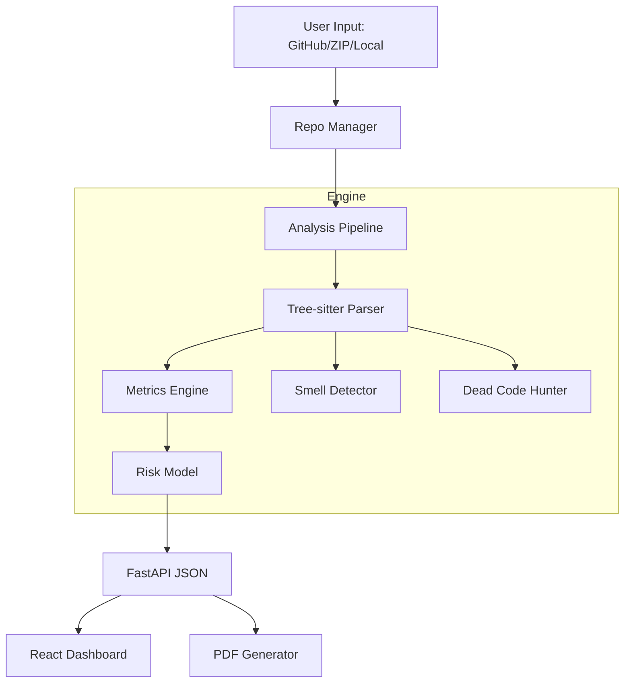

# Replexity — The Polyglot Code Intelligence Platform

An industrial-grade, AI-powered code analysis platform that decodes complexity, identifies risks, and surfaces architectural debt across **15+ programming languages**. 

Replexity transforms raw source code into actionable intelligence with high-fidelity AST parsing, scientific metrics, and interactive visualizations.


---


## 🌌 Core Capabilities

### 🔍 Deep Analysis
*   **Scientific Metrics**: Cyclomatic & Cognitive Complexity, Halstead Volume/Effort, and the Maintainability Index.
*   **Dead Code Detection**: Heuristic-based identification of orphaned functions and unused exports.
*   **Code Smell Engine**: Detects God Objects, Long Methods, Deep Nesting, and "Too Many Parameters" across languages.
*   **Dependency Graphing**: Visualizes file coupling (Afferent/Efferent) and project instability.

### 🛡️ Risk & Reliability
*   **AI Risk Scoring**: A multi-factor weighted model (0–100) classifying files from "Safe" to "Critical".
*   **Bug Hotspot Prediction**: Mathematical probability models identifying the most likely sources of future regressions.
*   **Clone Detection**: Cross-file duplicate code identification to reduce technical debt.
*   **Git Churn Integration**: Correlates change frequency with complexity to find "high-volatility" risk zones.

### 📊 Visualization & Reporting
*   **Interactive Heatmaps**: A bird's-eye view of project health using color-coded risk grids.
*   **File-Level Deep Dives**: Line-by-line metrics and prioritized refactoring suggestions.
*   **Premium PDF Reports**: Export high-fidelity, styled executive summaries for stakeholders.
*   **Health Score**: A project-level KPI (0–100) calculated from complexity, smells, and risk distribution.

---

## 🌍 Language Support

Replexity leverages **Tree-sitter** for industrial-grade parsing accuracy across a broad polyglot landscape:

| Category | Languages |
| :--- | :--- |
| **Web** | JavaScript, TypeScript, JSX, TSX, PHP |
| **Systems** | C, C++, Rust, Go, Swift |
| **Enterprise** | Java, C#, Kotlin |
| **Scripting** | Python, Ruby |

---

## 🚀 Installation

### Prerequisites
- **Python 3.10+**
- **Node.js 18+**
- **Git**

### 1. Initialize the Core
```bash
git clone https://github.com/AryanPandya0/Complexity-Visualizer.git
cd Complexity-Visualizer
pip install -r backend/requirements.txt
```

### 2. Prepare the UI
```bash
cd frontend
npm install
```

### 3. Launch Services

**Backend (Port 8000)**
```bash
uvicorn backend.main:app --reload
```

**Frontend (Port 5173)**
```bash
npm run dev
```

---

## 📐 The Risk Formula

Replexity calculates a file's **Risk Score** using a weighted linear combination of structural indicators:

$$Risk = 0.35(CC) + 0.20(LOC) + 0.20(ND) + 0.15(FL) + 0.10(BD)$$

Where:
- **CC**: Normalized Cyclomatic Complexity
- **LOC**: Lines of Code
- **ND**: Nesting Depth
- **FL**: Function Length
- **BD**: Branch Density

---

## 🏗️ Technical Architecture



---

## 🤝 Contributing
Replexity is open-source. We welcome contributions to our grammar support, risk models, and visualization components.

## 📝 License
Distributed under the **MIT License**. See `LICENSE` for more information.
